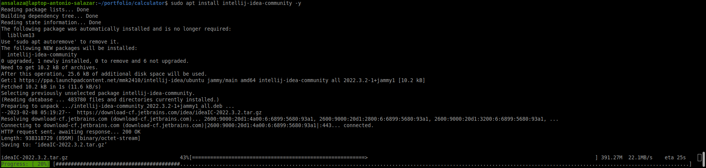

# :book: Installing intelliJ on Ubuntu 22.04

## Steps
1. Update your system packages.

    ```bash
    sudo apt update && sudo apt upgrade -y
    ```

2. Install the software support packages.

    ```bash
    sudo apt install vim apt-transport-https curl wget software-properties-common
    ```

3. Set-up the intellij package repository.

    ```bash
    sudo add-apt-repository ppa:mmk2410/intellij-idea -y
    ```

4. Install intelliJ on your system.

    ```bash
    sudo apt install intellij-idea-community -y
    ```

    ||
    |:--:|
    ||
    | Fig 1. intelliJ package installation process|

    ||
    |:--:|
    ||
    |Fig 2. intelliJ welcome page|